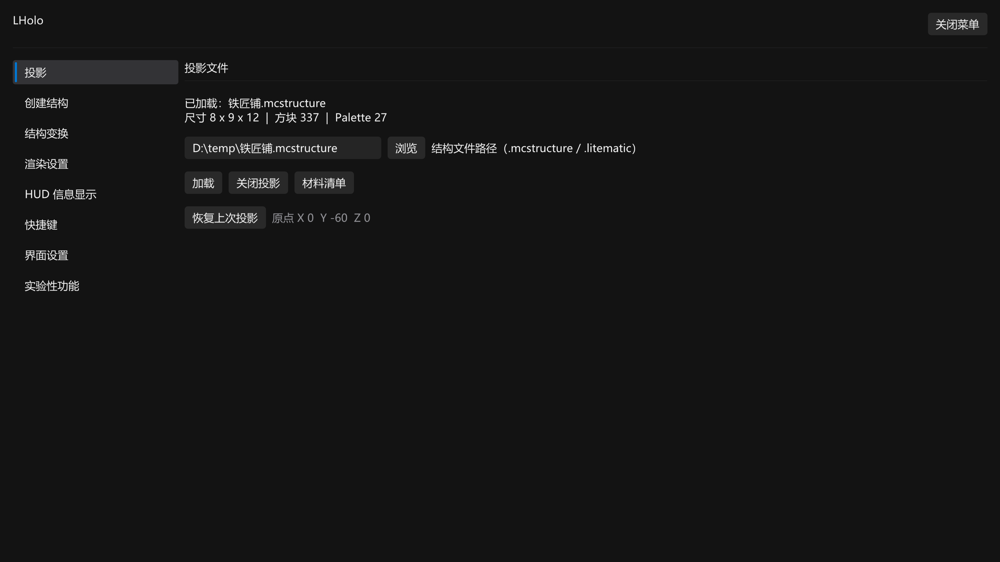
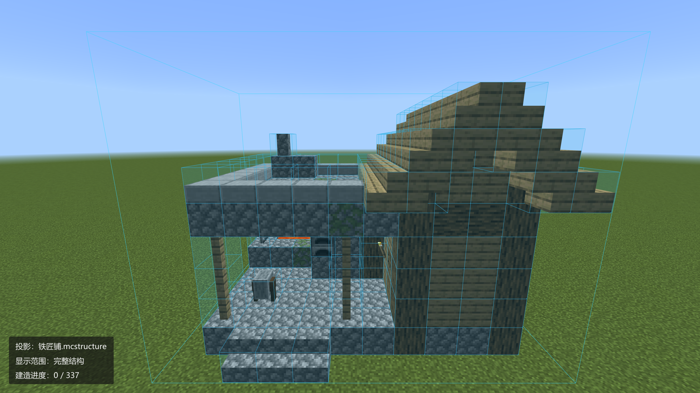
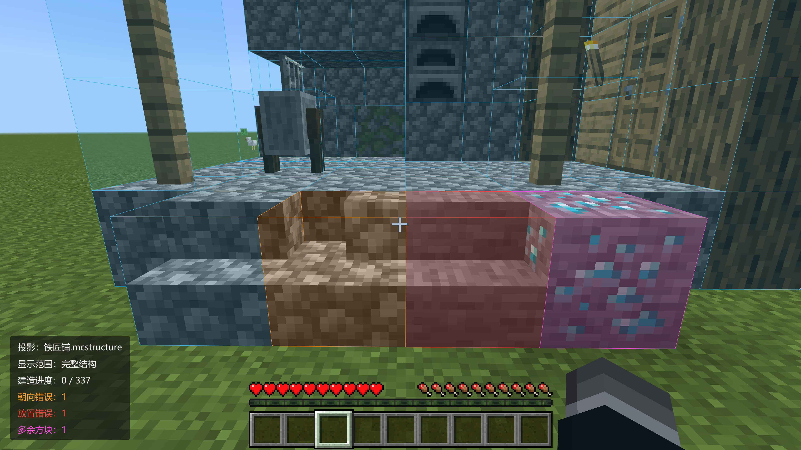
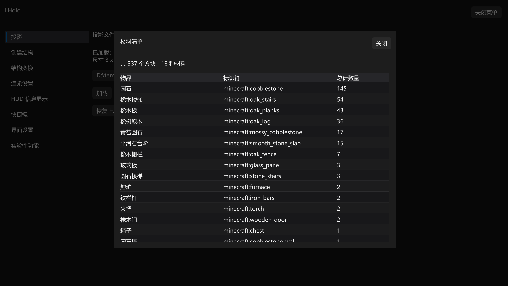
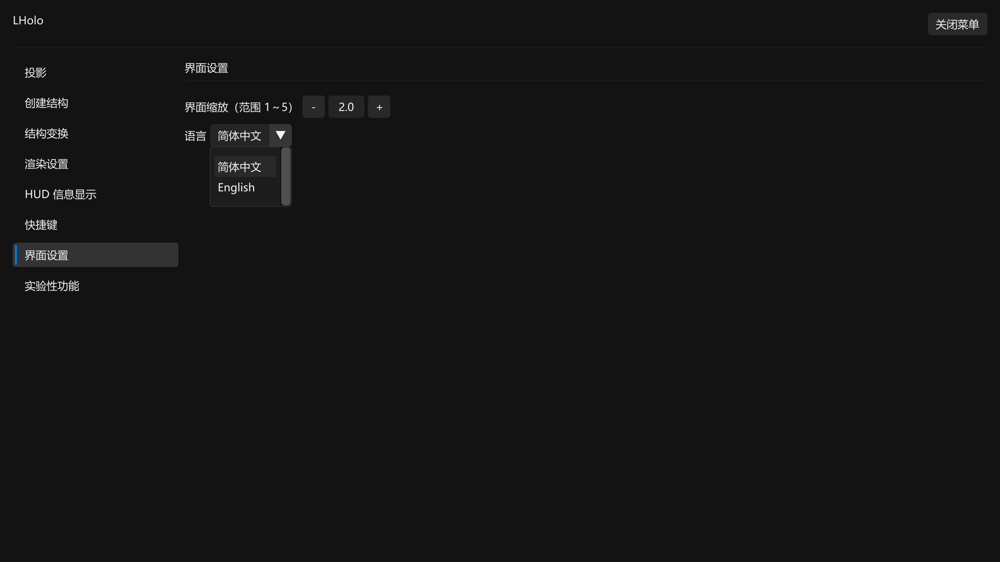

# LHolo

[English](README_EN.md)

`LHolo` 是一个 [LeviLamina](https://github.com/LiteLDev/LeviLamina) 客户端投影模组

## 快速上手

[安装教程](https://www.bilibili.com/opus/1239631121935761412)

1. 安装本模组以后,聊天栏输入 `LHolo`,或按 `Alt + M` 打开模组菜单
2. 本模组交互为GUI与快捷键(具体快捷键直接看模组菜单)
3. 使用本模组时,请关闭灵动视效

## 主要功能

**文件支持**

- 支持 `.mcstructure` 和 `.litematic`(Java 版 Litematica 蓝图)两种文件

**纠错系统**

- 蓝色 = 未放置投影方块
- 红色 = 方块放置错误
- 黄色 = 朝向或状态错误
- 品红色 = 多余方块

**分层建造**

- X或Y轴分层显示
- 材料分层显示

**结构变换**

- 移动
- 旋转 
- 镜像

**HUD 信息显示**

- 屏幕角落可显示:蓝图文件名、当前显示的层、建造进度(已放/总数)、各类错误数量、当前辅助放置模式等。
- 位置可放在屏幕四角,每一项都能单独开关。

**多语言支持**

- 简体中文
- English

## 模组演示

**模组菜单页面**

**加载结构**

**纠错**

**材料清单**

**语言设置**

入口：打开模组主菜单 -> 界面设置 -> 语言

****
